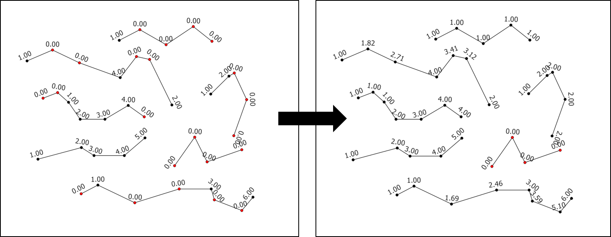

# Algorithm for QGIS 3 to interpolate missing Z values on a line Z vector layer.

This algorithm takes a line Z vector layer as input (consisting of one
or several lines) and performs the following:
* If the first or last vertices of a line have missing values, fill them in (extrapolate) by setting their value equal to the first/last valid ones found.
* Interpolate the remaining missing Z values.

## NULL Z data in QGIS

QGIS doesn't have a NULL for declaring missing Z values in vector layers.
A newly created Z vector layer will have Z values defaulting to 0.
The parameter `NoData Z` provides a way to declare what numerical value should
be considered as the NoData one. It should be 0 in most cases.

## An examplary use case

A line Z layer representing roads where the elevations would be
known only at a few locations. Interpolating the Z values between
these locations with the algorithm is a fast way to populate the Z
values of the layer. Doing it by hand could be really slow, particularly if the roads have curves, hence many vertices.

## Edge case handling

* If a line feature only has missing values, it is left as is.
* If a line feature has no missing value, it is left as is.

## Installation

## Usage

The algorithm is parameterized through the classic user interface provided by QGIS.

The algorithm provides a message for each line that it processes,
giving the user the ability to check the quality of the
input line Z layer and how each feature was processed.

The exemple below illustrates the log messages obtained after running
the algorithm for the example above. The messages in red are warnings
that point the user to have a closer look at the input line Z layer.

## Layer Style

QGIS has no way (as of writing in 03/2020) to directly label the Z values
of a vector layer. A style file (*.qml) was created to display the Z value of each vertex as a way to check whether the algorithm worked correctly. It also displays missing Z values (hardcoded at 0 in the style) with red markers.

The QML file can be downloaded [here](./display_and_label_z_vertices.qml).

One useful trick is to associate this style with the algorithm output.

## License

MIT License